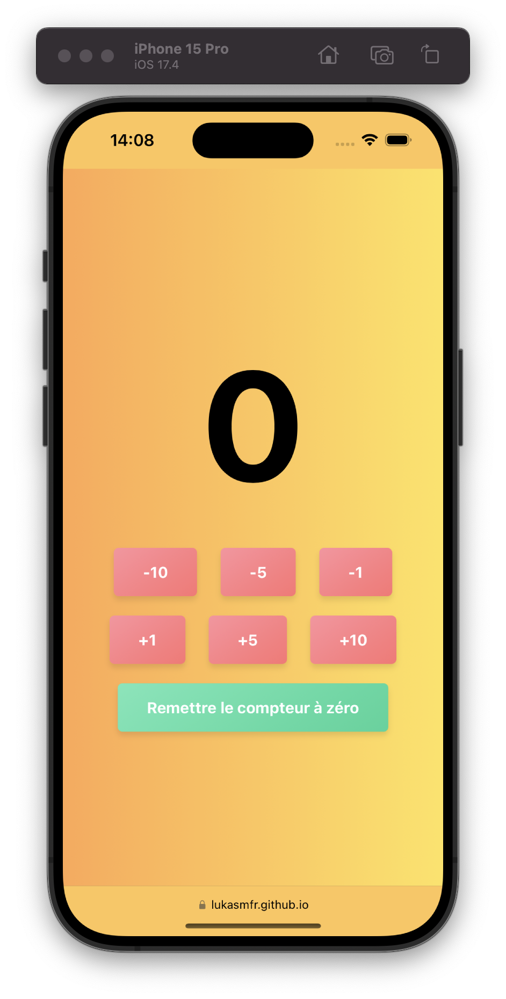
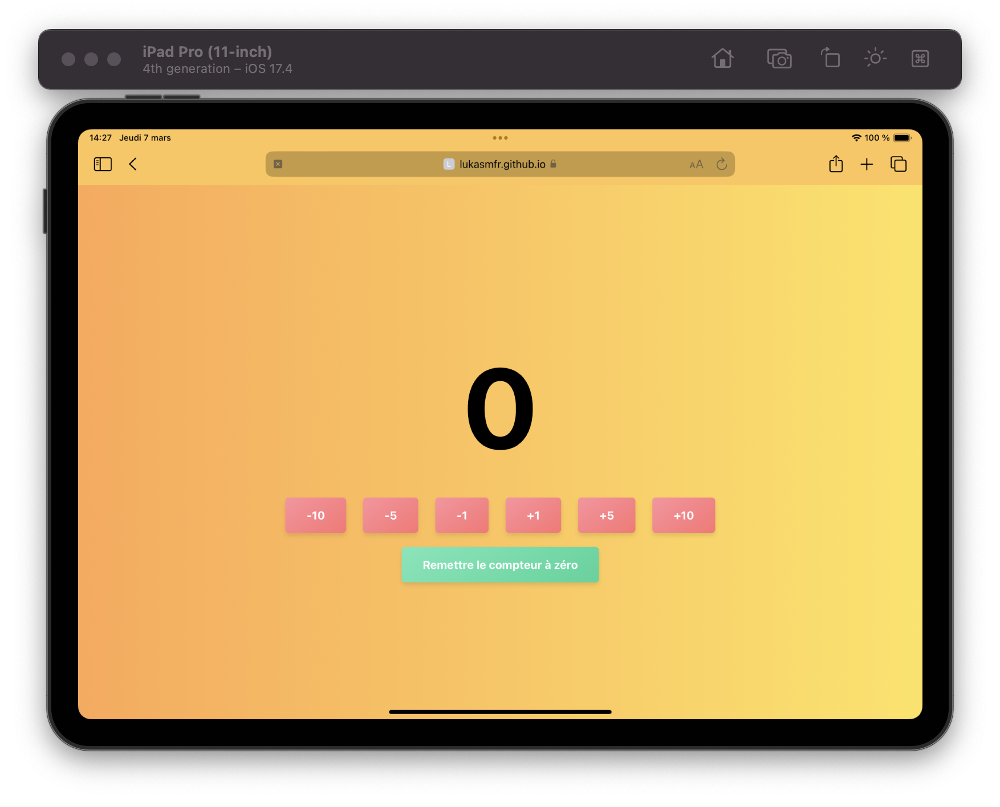

# Compteur

_Compteur_ is a simple counter website that allows you to count up or down. It is designed to be fully responsive, adapting to various devices from desktops to mobile phones with notches like the iPhone 15 Pro. It is built using HTML, CSS, and JavaScript to ensure a smooth and accessible user experience.

## Features

- Increase or decrease the count with predefined increments.
- Intuitive UI with vibrant gradient backgrounds.
- Responsive design for optimal viewing on all devices.
- No installation required - access directly through your web browser.

## Screenshots

### Mac - Safari

### iPhone 15 Pro - Safari Portrait Mode

  

### iPad Pro 11 - Safari Landscape Mode

## Usage

To use _Compteur_, simply navigate to the website in your web browser and start interacting with the buttons to modify the counter's value.

## Contributions

Contributions are welcome! If you have ideas on how to improve _Compteur_, feel free to fork the repository, make your changes, and submit a pull request.

## License

_Compteur_ is intended to be open and free to use. There is no license file, as it is released into the public domain for educational purposes and personal use.
